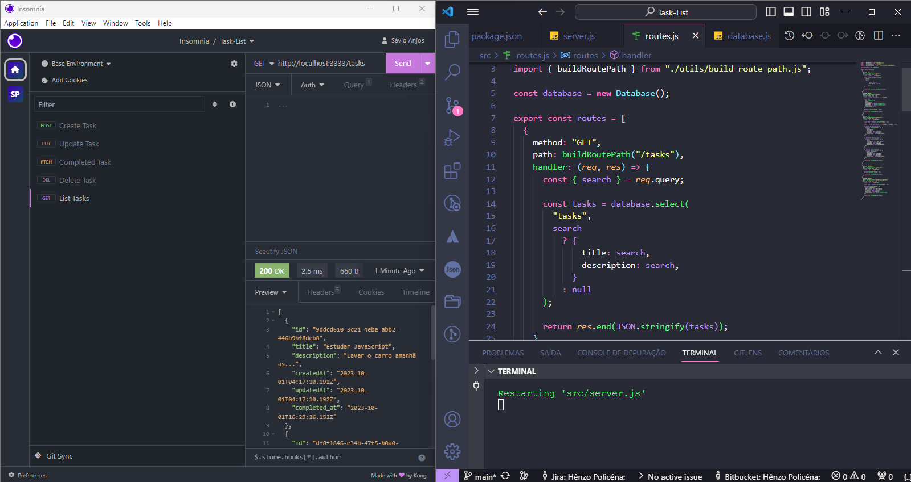

<p align='center'></p>

 <p align='center'>


  
</p>

## 🚀 Tecnologias

Esse projeto está utilizando as seguintes tecnologias:

- [Node](https://nodejs.org/en)

## 📜 Descrição

Esse projeto é um desafio proposto no curso Ignite da [Rocketseat](https://www.rocketseat.com.br/), o obejetivo foi criar uma API utilizando apenas node.js sem nenhum framework para colocar em prática os fundamentos da tecnologia.

## ⚙️ Como funciona?

- O usuário pode criar uma tarefa
- O usuário pode atualizar uma tarefa
- O usuário pode deletar uma tarefa
- O usuário pode listar todas as tarefas
- O usuário pode marcar uma tarefa como concluida

## 🎲 Quer customizar o projeto?

### Clone esse repositório

```bash
git clone https://github.com/Savio-Anjos/API-Task-List.git
```

### Navegue até o diretório do projeto

```bash
cd API-Task-List
```

### Inicie a aplicação

```bash
npm run dev
```

## 🖼️ Layout



---

<p>Criado com 💙 por <a href='https://github.com/Savio-Anjos/' target='_blank'>Sávio Anjos</a></p>
